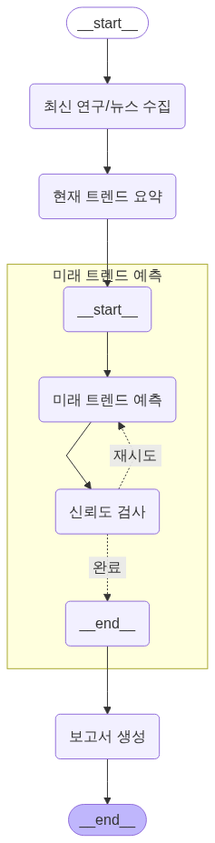

# Title

본 프로젝트는 **미래 기술 트렌드 분석 에이전트**를 설계하고 구현한 실습 프로젝트입니다.

## Overview

- Objective : 최신 논문 및 뉴스 데이터를 바탕으로 미래 기술 트렌드를 자동으로 분석하고 예측하는 시스템 구축
- Methods : Multi-Agent Orchestration, Retrieval-Augmented Generation
- Tools : LangGraph, LangChain, Chroma, OpenAI GPT-4o-mini, Tavily, 논문/특허 검색 API

## Features

- 사용자가 선택한 주제에 기반해 뉴스/논문 데이터 수집
- 핵심 기술 3가지를 자동 추출하고 요약
- 각 기술의 미래 발전 경로 및 산업 적용 가능성 예측
- 마크다운 형태의 분석 보고서를 자동 생성

## Tech Stack

| Category | Details |
| --- | --- |
| Framework | LangGraph, LangChain, Python |
| LLM | GPT-4o-mini via OpenAI API |

## Agents

- Agent 1: 최신 연구/뉴스 수집
- Agent 2: 기술 트렌드 요약
- Agent 3: 트렌드 예측
- Agent 4: 보고서 생성

## State

- keyword : 사용자가 선택한 기술 주제 키워드 입력값
- patent : 특허 수집 결과
- scholarly : 논문 수집 결과
- tavily : 뉴스 수집 결과
- trend_summary : 현재 기술 트렌드 분석 및 요약 결과
- trend_prediction : 미래 기술 트렌드 예측 결과 (발전 경로, 활용 분야, 신뢰도)
- result : 마크다운 형식으로 출력된 트렌드 보고서
- retry_count : 예측 신뢰도 낮을 경우 Agent 3으로 루프한 횟수

### 💡 State Definition 요약

| Agent | 입력 설명 | 출력 설명 |
| --- | --- | --- |
| Agent 1<br>연구/뉴스 수집 | 사용자가 선택한 기술 분야 주제 키워드 (ex. "AI", "neuro science" 등 영어로 입력) | 수집된 원문 문서 리스트 (최근 한 달 논문, 특허, 뉴스) |
| Agent 2<br>기술 요약 | Agent 1의 결과를 기반으로 요약에 사용할 텍스트 | 핵심 기술 5가지와 각 기술의 요약 정보 |
| Agent 3<br>트렌드 예측 | Agent 2의 요약 결과를 바탕으로 예측에 사용할 텍스트 | 미래 기술 트렌드 5가지 예측, 활용 분야, 신뢰도 예측 결과 |
| Agent 4<br>보고서 생성 | Agent 3의 예측 결과를 바탕으로 보고서 구성용 텍스트 | Markdown 형식의 최종 기술 트렌드 보고서 |

## Architecture
<p align="center">

</p>
## Directory Structure

```
├── agents/                # 에이전트별 모듈 구현
├── outputs/               # 생성된 보고서 저장
├── prompts/               # 프롬프트 템플릿
├── app.py                 # 전체 실행 스크립트
├── .env                   # 깃에는 없음
├── .gitignore             # 깃 설정 파일
└── README.md
```

## Contributors

- 김세은 : Prompt Engineering, Agent Design
